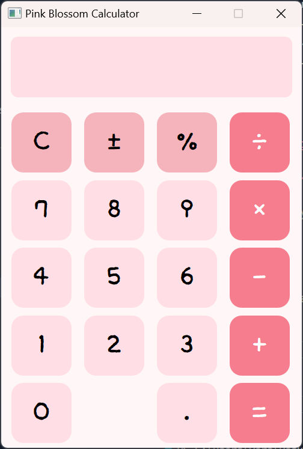

# 🌸 Pink Blossom Calculator

> PyQt5를 활용하여 제작한 예쁜 계산기입니다.  
> 사칙연산이 가능하며, 사용자 정의 폰트와 분홍 테마 UI를 통해 사용성을 향상시킨 프로젝트입니다.


## 수행 기능 요약

| 기능 | 설명 |
|------|------|
| 기본 사칙연산 | `+`, `−`, `×`, `÷` 연산 가능 |
| 부호 변경 | `±` 버튼으로 양수/음수 전환 |
| 퍼센트 계산 | `%` 버튼 제공 |
| 실시간 결과 입력창 | 버튼 클릭 시 계산식이 즉시 반영됨 |
| 사용자 정의 폰트 | `/fonts/calc_font.ttf` 적용 가능 |
| 분홍 테마 UI | 전체 배경, 버튼, 디스플레이를 분홍 계열 색상으로 구성 |
| 버튼 클릭 이벤트 | 숫자, 연산자, 기능키 모두 클릭 이벤트로 처리 |
| PEP8 준수 | 파이썬 스타일 가이드에 맞춰 작성된 코드 |


## 파일 구성

| 파일명 | 설명 |
|--------|------|
| `calculator.py` | 메인 계산기 실행 파일 |
| `fonts/calc_font.ttf` | 사용자 지정 폰트 파일 (없을 경우 기본 폰트 사용됨) |
| `README.md` | 본 문서 |


## 실행 방법

### 1. PyQt5 설치
```bash
pip install pyqt5
```

### 2. 실행
```bash
python calculator.py
```

> ⚠️ `fonts/calc_font.ttf` 경로가 존재하지 않거나 실패할 경우 기본 폰트로 대체됩니다.


## 계산기 디자인




## 요구사항 체크리스트

### ✔️ 필수 요구사항

| 항목 | 구현 여부 | 설명 |
|------|:--------:|------|
| Python 3.x 사용 | ✅ | Python 3.x 환경에서 작성 및 테스트 |
| PyQt5만 사용 | ✅ | 외부 라이브러리 없이 PyQt5만 사용 |
| 계산기 UI 구현 | ✅ | 아이폰 스타일 배치로 구현 |
| 숫자/연산 입력 기능 | ✅ | 버튼 클릭 시 실시간 입력 |
| 계산 결과 출력 | ✅ | `=` 버튼 누르면 결과 계산 |
| 코드 실행 시 경고 없음 | ✅ | 모든 버튼 및 연산 정상 작동 |
| 문자열 `' '` 사용 | ✅ | 문자열 기본 표현은 `' '` 사용 (PEP8 준수) |
| 대입문 공백 처리 | ✅ | `foo = 1`처럼 = 앞뒤 공백 유지 |
| 들여쓰기 공백 사용 | ✅ | 들여쓰기는 탭 대신 스페이스 4칸 사용 |


### ⭐ 보너스 과제

| 항목 | 구현 여부 | 설명 |
|------|:--------:|------|
| 사칙연산 기능 구현 | ✅ | `+`, `−`, `×`, `÷`, `=` 연산 전부 처리 가능 |


## 🙋‍♀️ 제작자

이름: 이채원 
소속: 동양미래대학교 컴퓨터소프트웨어공학과(학)  
과목: Codyssey 프로그래밍