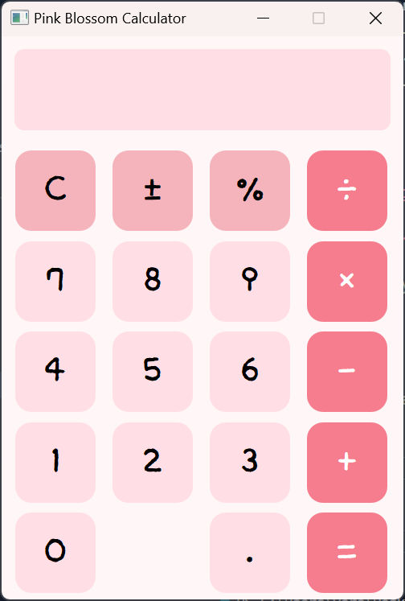

# 🌸 Pink Blossom Calculator

> PyQt5를 활용하여 제작한 예쁜 계산기입니다.  
> 사칙연산이 가능하며, 사용자 정의 폰트와 분홍색 UI를 통해 Pretty하게 계산할 수 있습니다.

---

## 수행 기능 요약

| 기능 | 설명 |
|------|------|
| 기본 사칙연산 | `+`, `−`, `×`, `÷` 연산 가능 |
| 부호 변경 | `±` 버튼으로 양수/음수 전환 |
| 퍼센트 계산 | `%` 버튼 제공 |
| 실시간 결과 입력창 | 버튼 클릭 시 계산식이 즉시 반영됨 |
| 소수점 입력 및 중복 방지 | `.` 입력 시 중복되지 않도록 제한 |
| 사용자 정의 폰트 | `/fonts/calc_font.ttf` 적용 가능 |
| 분홍 테마 UI | 전체 배경, 버튼, 디스플레이를 분홍 계열 색상으로 구성 |
| 결과에 따라 폰트 크기 조정 | 결과가 길어질수록 폰트 크기를 줄여 출력 |
| 소수점 6자리 반올림 | 결과값은 소수점 6자리까지 반올림 처리 |
| 예외 처리 | 0 나누기, 오버플로우 등 수학적 예외 처리 포함 |
| 버튼 클릭 이벤트 | 숫자, 연산자, 기능키 모두 클릭 이벤트로 처리 |
| PEP8 준수 | 파이썬 스타일 가이드에 맞춰 작성된 코드 |

---

## 파일 구성

| 파일명 | 설명 |
|--------|------|
| `calculator.py` | 메인 계산기 실행 파일 |
| `fonts/calc_font.ttf` | 사용자 지정 폰트 파일 (없을 경우 기본 폰트 사용됨) |
| `README.md` | 본 문서 |

---

## 실행 방법

### 1. PyQt5 설치
```bash
pip install pyqt5
```

### 2. 실행
```bash
python calculator.py
```

> `fonts/calc_font.ttf` 경로가 존재하지 않거나 실패할 경우 기본 폰트로 대체됩니다.

---

## 🎨 계산기 디자인



---

## ✅ 요구사항 체크리스트

### 필수 수행과제

| 항목 | 구현 여부 | 설명 |
|------|:--------:|------|
| Calculator 클래스 생성 | ✅ | 계산 로직 전용 클래스(`CalculatorLogic`) 분리 구현 |
| 사칙연산 메서드 구현 | ✅ | 내부적으로 연산 처리 (add, subtract 등 동등한 동작) |
| reset(), negative_positive(), percent() 구현 | ✅ | 초기화, ±, % 기능 정상 동작 |
| 숫자키 누적 입력 | ✅ | 버튼 클릭 시 문자열 누적 |
| 소수점 중복 방지 | ✅ | 이미 소수점이 있을 경우 재입력 방지 |
| equal() 메서드 구현 | ✅ | 계산 결과 출력 및 예외 처리 |
| UI와 로직 클래스 연결 | ✅ | 버튼과 로직 메서드 완전 연결 |
| 파일명 calculator.py | ✅ | 지정된 파일명으로 저장 |

### 개발 환경 및 코딩 규칙

| 항목 | 충족 여부 | 설명 |
|------|:--------:|------|
| Python 3.x 사용 | ✅ | Python 3.10 환경 |
| PyQt 외 외부 라이브러리 없음 | ✅ | `PyQt5`만 사용 |
| 문자열 `' '` 사용 | ✅ | 문자열 표현에 `' '` 기본 사용 |
| 대입문 공백 처리 | ✅ | `=` 앞뒤 공백 유지 |
| 들여쓰기 공백 사용 | ✅ | 탭 대신 스페이스 사용 |
| 경고 없이 실행 | ✅ | 실행 시 오류 없이 정상 작동 |
| PEP8 스타일 준수 | ✅ | 함수/클래스 명명, 주석, 줄 간격 등 규칙 적용 |

---

### ⭐ 보너스 과제

| 항목 | 구현 여부 | 설명 |
|------|:--------:|------|
| 결과 길이에 따른 폰트 크기 조정 | ✅ | `adjust_font_size()` 로 구현 |
| 소수점 6자리 반올림 | ✅ | `round(result, 6)` 적용 |

---

## 🙋‍♀️ 제작자

이름: 이채원  
소속: 동양미래대학교 컴퓨터소프트웨어공학과(학)  
과목: Codyssey 프로그래밍